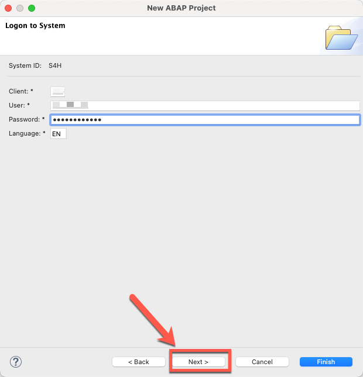
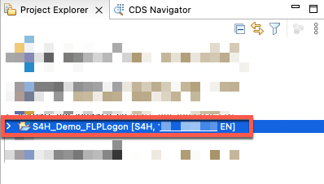
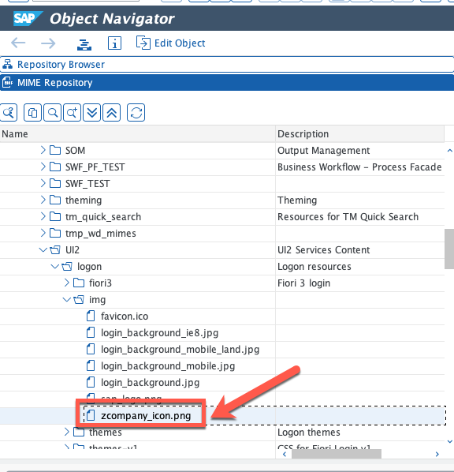

# Basic preparation and uploading images to the MIME Repository

## Description

In this section you will find the steps to setup your development workspace and prepare to customize the sAP Fiori Launchpad Logon page.  

## Create a new ABAP Project in ADT (Eclipse)
You should start by creating a new ABAP project for your SAP S/4HANA system. To do this follow the next steps:

1. Create a new project in ADT.

  

2. Select the backend system you will connect to and click **Next**.

  

3. Confirm system connection parameters (or edit as needed) and click **Next**.

  **NOTE - In this screen you may also create a new connection from scratch.**

  

4. Enter your system Id to setup a connection to the backend system and click **Next**

  

5. Setup a friendly name for your ABAP project (for example: <SID>_Demo_FLPplugin) and click **Finish**.

  

6. Once all steps are run you will find your new project in the **Project Explorer** section in ADT.

  

## Creating a development package

7. In **Project Explorer**, expand **Favorite Packages** and right-click on your recently created package structure. From the menu select **New >> ABAP Package**

  

8. Enter the following information and click **Next**:
  * Name: **<< Your package name >>** (for example: ZCUSTOM_OBJECTS4STMPNK).
  * Description: **<< Your package description >>** (for example: Custom Objects for Embedded Steampunk).
  * Add to favorite packages: **Inactive**
  * Superpackage: **<< Your package structure name >>** (this should be the same name you defined in Step 17 - for example: ZEMBEDDED_STEAMPUNK).
  * Package Type: **Development**

  

9. Select an existing transport request or create a new one to save your changes and click **Finish**

  

10. Once created, package details will be displayed in the screen.

  **NOTE** - Try expanding the structure hierarchy in **Project Explorer** as your recently created package will be used in the following sections, additionally, you should notice that the ABAP Language version has already been setup for your development package. This setting will restrict your ABAP code to only consume cloud-released objects.

  

## Uploading images to MIME repository

11.

## Next Steps
In the next section you will create a custom BSP so you can test the logon class without disturbing end-users.

To continue with this exercise go to [Exercise 2](../ex_2)
