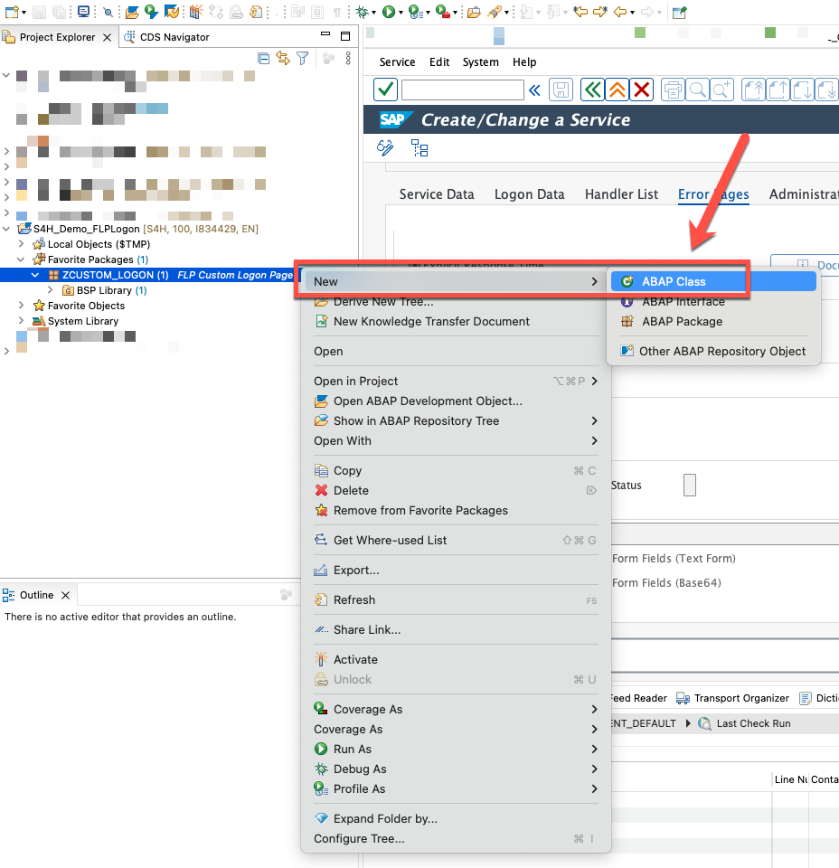
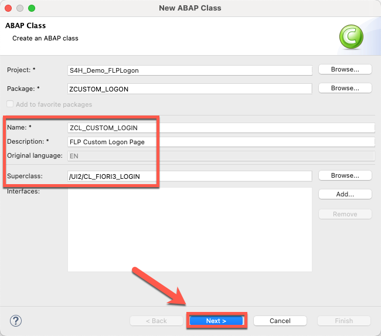
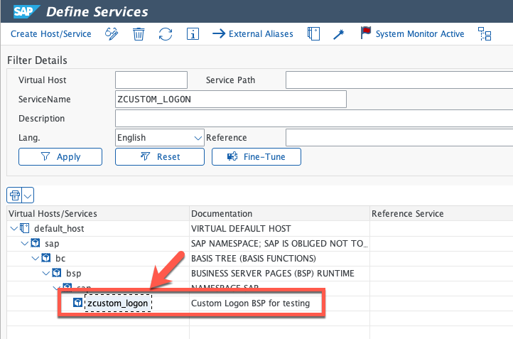
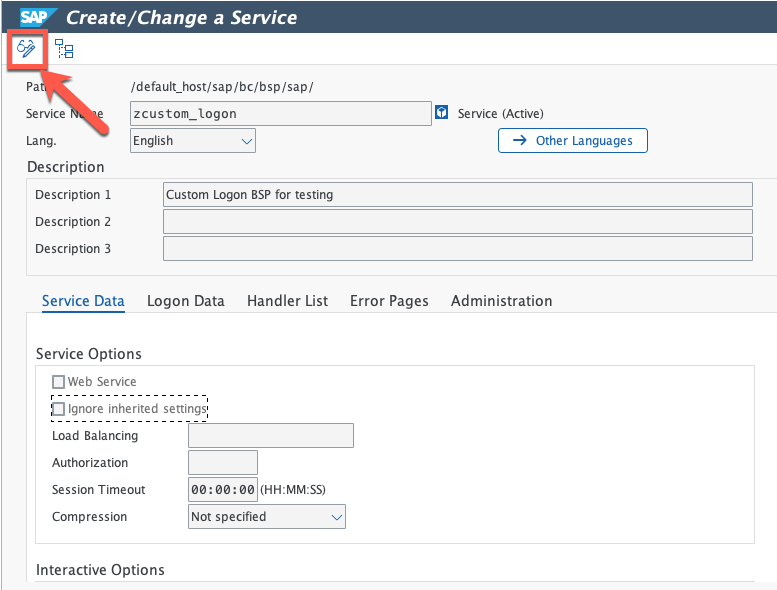
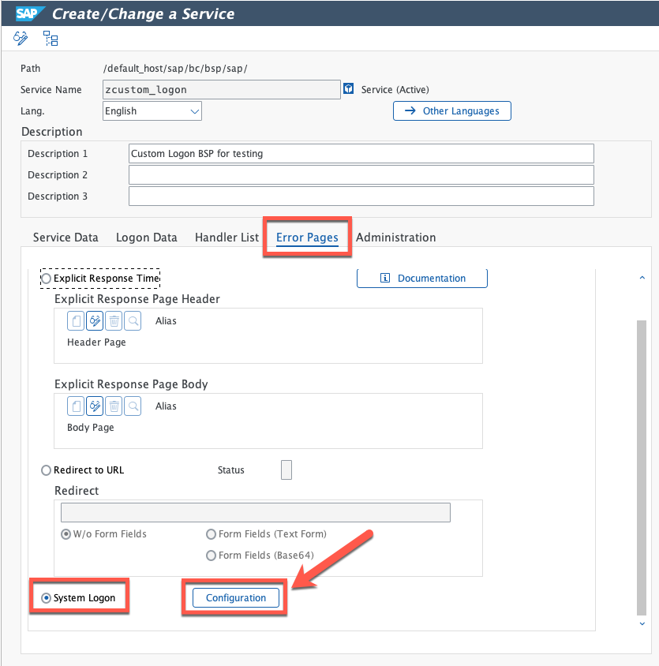
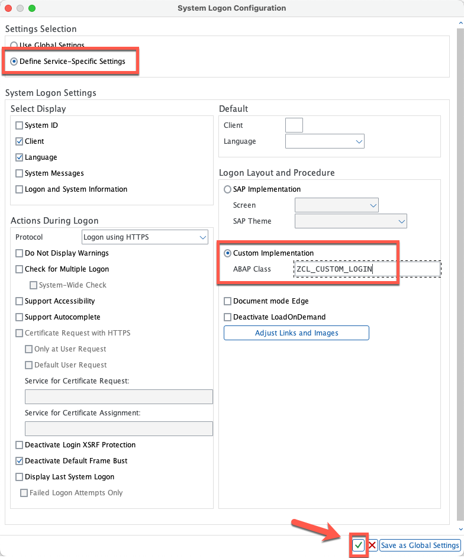
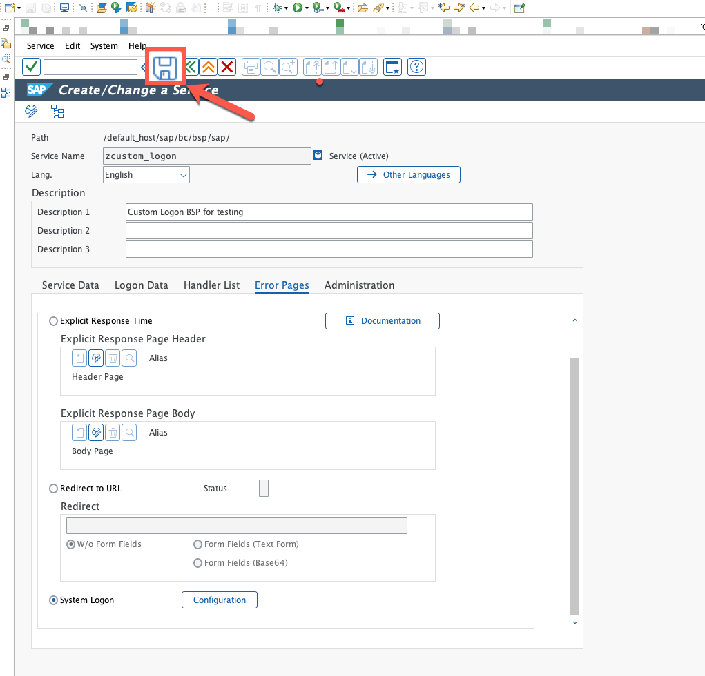
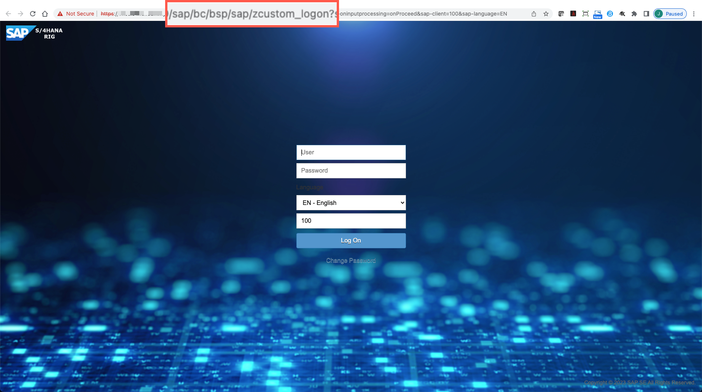

# Creating a custom class for redefinition of standard logon class

## Description

In this section you will find the steps to create a custom class and add code to edit the background image and icon displayed in the logon page.  

## Creating a custom class.

33. In **Project Explorer**, right-click on your package and in the menu navigate to: **New >> ABAP Class**.

  

34. Enter the following information and click **Next**:
  * Name: **<< Your custom class name >>** (for example: ZCL_CUSTOM_LOGIN).
  * Description: **<< Your custom class description >>** (for example: FLP Custom Logon Page).
  * Superclass: **/ui2/cl_fiori3_login**

  

35. Select an existing transport request or create a new one to save your changes and click **Finish**

  

36. Copy **ALL** code from our sample class [zcl_custom_login](sources/zcl_custom_login.abap) into your recently created class. **Save** and **Activate** your class.

  

## What does this code do?

In this section you will find a brief explanation of the code.

  

  37.1 In this section we are declaring that our class will inherit all features from the standard login class, additionally we are specifying we will redefine one of the standard methods: **init_default_properties**. In this method is where we will add our custom code to adjust the logon page.

  37.2 In this section we are defining the code of our custom implementation of method **init_default_properties**, we are first instantiating the original class and once done, we are rewriting some of the parameters, in this case, the values for the **image logo, image logo width, background image and login title (the text in the browser tab)** are being overwritten.

## Testing the custom class

38. In transaction SICF, double click on your custom BSP page (for example: ZCUSTOM_LOGON).

  

39. Once displayed, switch to **Edit** mode.

  

40. Navigate to **Error pages**, activate the **System Logon** radio button and click on **Configuration**

  

41. In the **System Logon Configuration** menu, activate radio button: **Define Service-Specific Settings** followed by activating radio button **Custom Implementation** and entering the name of your custom class (for example: **ZCL_CUSTOM_LOGIN**). Once done, click on **Ok** button and accept all messages.

  

42. Once changes have been done, click on **Save**.

  

43. Go back to your browser and refresh the BSP page. You should now see the new custom logon page

  

  **NOTE** - Despite logon page might look good, some texts are not visible anymore, to adjust these you might need to add some extra logic. This will be covered in the next exercise.

## Next Steps
In the next section you will create custom javascript code to change the color of language and change password texts.

To continue with this exercise go to [Exercise 4](../ex_4)
